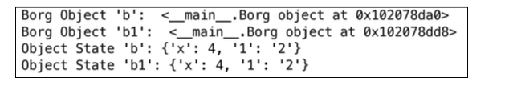
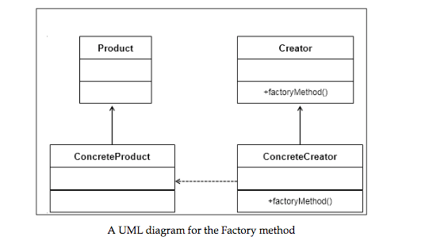

# Object oriented Design Interview Questions (Gayle Cracking)

## How to Appraoch

### 1. Handle Ambiguity
They test you on whether you'll make assumptions or if you'll ask clarifying questions. You should enquire who is gonna use it and how they are going to use it. You might want to go through the 6 W's.

Sounds simple at first but problems can get intense. For example, coffee maker design might be complicated.

### 2. Define Core Objects

Consider the 'core objects' in a system. Example, design a restaurant. Well, our core objects might be:

- Waiter
- Chef
- Customer
- Party
- Meal
- Host
- Server
- Employee
- Table

### 3. Analyze Relationships

OK, now let's analyze the relationship between the objects. Which objects are members of each other? What about inheritance? Are relationships one to omany or many to one?

For example:

- Party should have an array of guests
- Server and Host inherit from Employee
- Table has one Party, but Party may have multiple tables
- There is one Host for the Restuarant

You can also make mistakes in your assumptions. For example, a Table may have multiple parties if its a trendy commnal tables restaurant

### 4. Investigate Actions
Consider the key actions objects make and how they relate to each other. Maybe you forgot some objects. For example, Party walks into a Restaurant, Guest requests a Table from the Host. Host looks up Reservation, if it exists, and assigns the Party to a Table. Otherwise, Party, is added to the end of the list. When Party leaves, Table is freed and assigned ot new party in the list 


## Design Patterns
Not a huge focus apparently. 
### Singleton Class

Java snippet:

~~~ java
public class Restaurant {
	private static Restaurant _instance = null;
	protected Restaurant() {...}
	public static Restaurant getInstance() {
		if (_instance == null) {
			_instance = new Restaurant();
		}
		return _instance;
	}
}

~~~

### Factory Method
~~~ java
public class CardGame {
	public static CardGame createCardGame(GameType type) {
		if (type == GameType.Poker) {
			return new PokerGame():
		} else if (type == GameType.BlackJack) {
			return new BlackJackGame();
		}
		return null;
	}	
}
~~~
Factory method offers interface for creating an instance of a class, subclasses deciding which class to instantiate. Options: implement this with the creator class being abstract and not providing an implementation for Factory method. Or you could have the Creator class be a concrete class that provides an implementation for the Factory method. Factory method would need to take a parameter which class to instantiate

## Interview Questions

### Deck of Cards
Statement: Design the data structures for a generic deck of cards. Explain how you would subclass the data strutures to implement blackjack.

generic deck of cards can mean anything. Need to clarify that it is 52 card set.


~~~ python
# Python Solution
class Card:
	def __init__(self, val, suit):
		self.val
		
		
class Suit


class Deck:
	def __init__(self):
		self.cards = 52*[None]	
                                                                                                                                 


~~~

~~~ java
public enum Suit {
	Club (0), Diamond (1), Heart (2), Spade (3);
	private int value;
	private Suit(int v) { 
		value = v;
	}
	public int getValue() { 
		return value;
	}
	
	public static Suit getSuitFromValue(int value) {
		...
	}
}

# implement Card as abstract since without a specific game, methods like value() 
# don't make much sense
public abstract class Card {
	private boolean available = true;
	
	# card number
	protected int faceValue;
	protected Suit suit;
	
	# Card constructor
	public Card(int c, Suit s) {
		faceValue = c;
		suit = s;
	}
	
	public abstract int value();
	public Suit suit() {
		return suit;
	}
	
	# check if card is available
	public boolean isAvailable() {
		return available;
	}
	
	public void markUnavailable() {
		available = false;
	}
	
	public void markAvailable() {
		available = true;
	}
}

public class Deck <T extends Card> {

	# all cards
	private ArrayList<T> cards;  
	
	private int dealtIndex = 0; # first dealt card
	
	public setDeckOfCards(ArrayList<T> deckOfCards) {...}
	
	public void shuffle() {...}
	public int remainingCards() {
		return cards.size() - dealtIndex;
	}
	
	public T[] dealHand(int number) { ...}
	
	public T dealCard() { ...}

}

public class Hand <T extends Card> {
	protected ArrayList<T> cards = new ArrayList<T>();
	
	public int score() {
		int score = 0;
		for (T card : cards) {
			score += card.value();
		}
		return score;
	}
	
	public void addCard(T card) {
		cards.add(card);
	}
}


# BlackJack game

public class BlackJackHand extends Hand<BlackJackCard> {
	public int score() {
	
	}
}

~~~


# Design Patterns

## Overview
1. Creational
2. Structural
3. Behavioral

# Creational Patterns


## Singleton 

### Intentions
- Ensure one object gets created
- provide global access point
- controll concurrent access to resources that are shared


### Use Cases
- logging or database operations
- thread pools, caches, dialogue boxes
- registry settings
- printer spoolers


### Implementation

~~~ python
class Singleton(object):
	def __new__(cls):
		if not hasattr(cls, 'instance'):
			cls.instance = super(Singleton, cls).__new__(cls)
		return cls.instance

------
s = Singleton()

s1 = Singleton()	
~~~

- `__new__` is Python's special method to instantiate object
	- 	we override to control the object creation
	-  basically prevent another object of that class to be instantiated


### Lazy instantiation
- work with reduced resources and create them only when needed


~~~ python
class Singleton:
	__instance = None
	def __init__(self):
	if not Singleton.__instance:
		print("__init__ method called")
		
	else:
		print("Instance already created:", self.getInstance())
	
	@classmethod
	def getInstance(cls):
		if not cls.__instance:
			cls.__instance = Singleton()
		return cls.__instance
		
	
	s = Singleton() # class initialized, but object not created
	print("object created", Singleton.getInstance())
	
	s1 = Singleton() # instance already created

~~~
### Module level singletons
- all modules are singletons by default because of Python importing behavior
- How does python work?
	1.  check whether a Python module has been imported 
	2. if imported, returns object for module, if not imported, instantiate it
	3. when module gets imported, it is intiialized. does not get initialized if it is imported again

### Monostate Singleton Pattern
- What does a programmer need? instances sharing the same state
- Let's try this:

~~~ python
class Borg:	
	__shared_state = {"1":"2"}
	def __init__(self):
		self.x = 1
		self.__dict__ = self.__shared_state
		pass
		
		
----
# Now lets make the objects
b = Borg()
b1 = Borg()
b.x = 4

# b and b1 are distinct objects, but b and b1 share the same state:
print("b state", b.__dict__)
print("object state b1", b1.__dict__)	
~~~
Output of shared state Borg



- `__dict__` variable assigned to `__shared_state`
	- `__dict__` is used to store state of every object of a class
	- we intentionally assigned `__shared_state` to all created instance
- technically, we get two different objects unlike **Singleton**. But we share state
- We can also do it like this:

~~~ python
class Borg(object):
	_shared_state= {}
	def __new__(cls, *args, **kwargs):
		obj = super(Borg, cls).__new__(cls, *args, **kwargs)
		obj.__dict__ = cls._shared_state
		return obj
~~~
### Singletons and metaclasses
### What are metaclasses?
- metaclass is a class of a class, aka class is an innstane of its metaclasses
- you can create classes of your own type from predefined Python classes
- since `type(int)` returns `type`, we know there is a metaclass present
- What happens when create some `class A`?
	- Python creates it by ` A = type(name, bases, dict) `
	- `name` -> name of the class
	- `base` -> base class
	- ` dict ` -> attribute variable
- Python's special `__call__` method gets called when an object needs to be created for an already existing class

Let's implement Singleton with metaclasses:

``` python
class MetaSingleton(type):
	_instances = {}
	def __cal__(cls, *args, **kwargs):
		if cls not in cls._instances:
			cls._instances[cls] = super(MetaSingleton, cls).__call__(*args, **kwrargs)
		return cls._instances[cls]
		
class Logger(metaclass=MetaSingleton):
	pass

logger1 = Logger()
logger2 = Logger()
	
```

### Practical Use Case 1 - database application
- Consider example of cloud service that involves read and write operations on database
- service is spread across multiple services
- action on UI of web app internally calls API which eventually results in a DB operation
- Shared resource across different resource is database itself
	- need to take care of consistency across operations in database, operations should result in conflicts 
	- memory and CPU utilization should be optimized for handling of multiple operations on databse	
#### Sample Python implementation

``` python
import sqlite

# create a metaclass
class MetaSingleton(type):
	_instances = {}
	
	# special __call__ method is used in the metaclass to create a Singleton
	def __cal__(cls, *args, **kwargs):
		if cls not in cls._instances:
			cls._instances[cls] = super(MetaSingleton, cls).__call__(*args, **kwrargs)
		return cls._instances[cls]
	
# decorated by the MetaSingleton class	
class Database(metaclass=MetaSingleton):
	connection = None
	def connect(self):
		if self.connection is None:
			self.connection = sqlite3.connect('db.sqlite3')
			self.cursorobj = self.connection.cursor()
		return self.cursorobj
	
db1 = Database().connect()
db2 = Database().connect()

# these will print the same cursor object at the same memory location
print ("database boejcts DB1", db1)
print ("Databse object DB2", db2)
	
```
- When `Database` class is instantatiated, it creates only one object
- When application wants to make operations on DB, it gets access to 1 database object
	- calls are therefore synchronized, and inexpensive on system resources	
- What if we have a clustered setups with multiple web apps but only 1 DB?
	- hmm, not good for Singletons because every web app adds a Singleton and a database query object
	- will result in unsynchronized database operations and is heavy on resources
	- we should use database connection pooling rather than Singletons

### Practical Use Case 2 - Health Check Service 

#### Implementation

~~~ python
class HealthCheck:
	_instance = None
	def __new__(cls, *args, **kwargs):
		if not HealthChek._instance:
			HealthCheck._instance = super(HealthCheck, cls).__new__(cls, *args, **kwargs)
		return HealtCheck._instance
	
	def __init__(self):
		self._servers = []
	
	def addServer(self):
		self._servers.append("server 1")
		self._servers.append("server 2")
		self._servers.append("server 3")
	
	def changeServer(self):
		self._servers.pop()
		self._servers.append("Server 5")
		
hc1 = HealthCheck()
hc2 = HealthCheck()	
	

~~~ 	


### Drawbacks of Singleton Pattern
- Global variables can be changed by mistake at one place, and may be used incorrectly by developer in other places
- multiple references may get created to the same object
- tight coupling to global variables, since global data by one class can inadvertently impact other lasses


## Factory Design Pattern

### Overview
- arguably most used design pattern
- useful because it creates a simplified implementation for client, and adding new classes to factory don't need to be done by client, who doesn't need to know about these details


### Understanding
- factory -> class responsible for creating objects of other types
- typically, factory class has an object and methods associated with
- client class this methodwith certain parameters
- Why do we need a factory class if the client can directly create an object? Some advantages:
	- loose coupling, object can be created independent of class implementation
	- A simplified implemntation for the client. client doesn't need to know of class that creates the object
	- adding another class to factory to create objects of another type can be easily done without the client changing the code. Client can just pass another parameter


### Variants of Factory Pattern
- Simple Factory pattern
	- allows interfaces to create objects without exposing object creation logic
- Factory Method pattern
	- allows interfaces to create objects, but defers decision to subclasses to determine the class for object creation 
- Abstract Factory Pattern
	- abstract factory is an interface to create related objects without speicfying/exposing their classes
	- provides objects of another factory


#### Simple Factory Pattern


~~~ python
# ABCMeta is Python's special metaclass to make a class abstract
from abc import ABCMeta, abstractmethod

class Animal(metaclass = ABCMeta):
	@abstractmethod
	def do_say(self):
		pass

class Dog(Animal):
	def do_say(self):
		print("WOOOF")
		
class Cat(Animal):
	def do_say(self):
		print( "Meow")
		
# forest factory defined
class ForestFactory(object):
	def make_sound(self, object_type):
		return eval(object_type)().do_say()
		
# client code
if __name__ == "__main__":
	ff = ForestFactory()
	animal = "Cat"
	ff.make_sound(animal) # outputs "Meow"		
	
~~~ 

#### Factory Method pattern

#### Overview
- fatory method reation is through inheritance, not instantiation
- define an interface to make objects, but we defer responsibility to create object to subclass





##### Implementation

We'd like to create profiles of different social networks. Want to have the right sections depending on the network.

~~~ python
from abc import ABCMeta, abstractmethod

# the Product Interface
class Section(metaclass=ABCMeta):
	@abstractmethod
	def desribe(self):
		pass

class PersonalSection(Section):
   def describe(self):
       print("Personal Section")
   
class AlbumSection(Section):
   def describe(self):
       print("Album Section")
   
class PatentSection(Section):
   def describe(self):
       print("Patent Section")
   
class PublicationSection(Section):
   def describe(self):
       print("Publication Section")	
   
   
# the Creator abstract class  
# this abstract class provides a factory method createProfile, which should be 
# implemented in by ConcreteClass to actually create the profile with appropriate sections
# Profile is not aware of what sections each profile should have, we let the subclass decide  
# class Profile(metaclass=ABCMeta):
	def __init__(self):
		self.sections = []
		self.createProfile()
	
	@abstractmethod
	def createProfile(self):
		pass
		
	def getSections(self):
		return self.sections
		
	def addSection(self, section):
		self.sections.append(section)


# we also create 2 ConcreteCreator classes
class Linkedin(Profile):
	def createProfile(self):
		self.addsections(PersonalSection())
		self.addSections(PatentSection())
		self.addSections(PublicationSection())

class facebook(Profile):
	def createProfile(self):
		self.addsections(PersonalSection())
		self.addsections(AlbumSection())

# client code that determines which Creator lass to instantiate
if __name__ == "__main__":
	profile_type = eval("Linkedin")
	profile = profile_type()
	
~~~

##### Advantages
- brings a lot of flexibility and makes code generic
- loose coupling, code that creates the object is separate from the code that uses it. client doesn't need to worry about what argument it o pass and which class to instantiate. 


#### Abstract Factory Pattern
Main objective is to provide an interface to create families of related objects without specifying the concrete class. 	


# Model View Controller - Compound Patterns

Compound Platforms - a general solution to a problem. Combines two or more patterns into a solution that solves a general problem.


MVC is a software pattern to implement user interfaces and and architecture that can be easily modified and maintained. 

Breakdown:

- **Model:** Represents the data and business logic (how information is stored and queried)
	- `model` class defines all operations that happen on the data (create, modify, delete, etc) and provides methods on how to use data	
	- critical that hte model stays consistent across multiple platforms
- **View:** Representation of data
	- will have methods that help us build web or GUI interfaces based on context 
	- flexibility necessary to display on desktop, mobiles, tablets, and different screen sizes
- **Controller:** Glue between the two, directs the model and view to behave in a certain way based on what a user needs
	- controls interaction of user on the interfaceer
	- used to receive data from request and send it to other parts of system
		- user clicks on a certain element, then controller makes a call to the model to do actions
	- has methods that are used to route requests
	- should not make database calls or get invovled in presenting data

View and controller are dependent on the model, but not the other way around

MVC pattern used when:

- need to change presentation without changes in the business logic
- multiple controllers can be used to work with multiple views to change the representation on the user interface
- model can be changed without affecting view

Goals:

- keep data and presentation layer separate
- easy maintenance of class and implementation
- flexibility to change the way in which data is stored and displayed

## Website Case

What happens on a web site?

- User interacts with view. View is a web page presented to you with buttons. You click on buttons on view and it tells controller what needs to be done
- Controllers take input from the view and send it to model. Model gets manipulated based on actions done by the user
- Controllers can also ask view to change based on action it receives from user, like changing buttons, presenting additional UI elements, etc
- Model notifies change in state to view
- view displays state that it gets directly from the model


## Sample App
Goal: develop an app that tells a user about marketing services delievered by a cloud company. 

Start with Model class. each service has rates, such as 1,000 emails = $2, 1,000 messages = $10, etc. Represent data about the product services and prices.

Define view class. provides method to present info to client `list_services()` and `list_pricing` 

### Implementation

~~~ python
# Model

class Model(object):
	services = {
		'email': {'number': 1000, 'price': 2}
		'sms': {'number': 1000, 'price': 10}
		'voice': {'number': 1000, 'price': 15}
	}

class View(object):
	def list_services(self, services):
		for sv in services:
			print(svc, ' ')
	
	def list_pricing(self, services):
		for svc in services:
			print (Model.services[svc]['number'], svc, "message you pay $", Model.services[svc]['price'])

class Controller(object):
	def __init__(self):
		self.model = Model()
		self.view = View()
	
	def get_services(self):
		services = self.model.services.keys()
		return self.view.list_services(services)
	
	def get_pricing(self):
		services = self.model.services.keys()
		return self.view.list_pricing(services)
~~~


# Anti-Patterns

## Introduction
Aspects of bad design:

- **Immobile**: Application is developed in such a way that it is hard to reuse
- **Rigid:** Any small change may in turn result in moving of too many parts of the software
- **Fragile:** Any change in urrent application results in breaking existing system easily
- **Viscose:** Changes are done by developer in the code or environment itself to avoid difficult archietctural level changes

Definition: An AntiPattern is an outcome of a solution to recurring problems so that the outcome is ineffective and becomes counterproductive


2 main types of antipatterns:

- Software development antipatterns
- Software architecture antipatterns


Many times, software deviates from original code structure during development, in part due to:

- thought process of developer evolves w/ development
- use cases change based on customer feedback
- data structures designed initially may change with functionality or scalability considerations

Refactoring happens often. Even though it has a negative connotation, it is actually really important, since it is really an opportunity to do rehashing and look back and reevaluate.

## Spaghetti code

characteristics: 

- software control flows get tangled and structures are developed in an ad hoc manner
- difficult to maintain and optimize
- minimal reuse of structures
- high maintaince
- extension and flexibility to change is reduced

Causes:

- ignorance on OO programming and analysis 
- product architecture or design that is not considered
- Quick fix mentality
- 


## Golden Hammer - Solution to all problems
Using a proven solution irrespective of whether it suits the need.


Causes:

- comes as a recommendation from the top who are not neccessarily close the problem at hand
- A solution has yielded many benefits in the past but in projects with different contexts and requirements
- company is stuck with this tech as they have invested money in training the staff or staff comfort

Consequences:
- solution is obsessively applied to all software projects
- product is described, not by features, but by tech used in dev
- "That Could have been better using this" talk 
- requirements not complete and not in sync with user expectations


## Lava Flow
related to Dead Code, or unusable code, lying around somewhere in fear of breaking something else if it is modified. Lava turning into hard rock

Causes:

- lots of trial and error code in production
- single handed written code that isn't reviwed and is handed over to other dev teams without any training
- initial thought of architecture, but no one understands it anymore

Symptoms:
- low code coverage for developed tests
- a lot of occurrences of commented code without reasons
- obsolete iterfaces

## Copy-and-paste programming

experienced developers put their code snippets online as solutions to commonly occuring issues. others use this code and just move on, without validating that is the most optimized code or that even fits context

Causes:

- novice developers not used to writing code 
- quik bug fix or moving forward with development
- code duplication for need of a ode structure or standardization oacross modules
- lack of long term thinking

Consequences:

- similar issues across application
- higher maintenace costs
- less modular code base 

## Software architecture AntiPatterns
System arch. focuses on design, tools, hardware, etc., software architecture looks at modeling the software that is well understood by the dev and test teams, product managers, stakeholders. 


### Reinventing the Wheel

What does NOT reinventing the wheel really mean? Architecture reuse. Reuse earlier devised thought process

Causes:

- lak of central documentation or repo about architecture level problems already solved
- lack of communication b/w tech leaders
- building from scratc hsi the process folowed in the organziation. 

Consequences:

- too many solutions to solve one standard problem
- closed ssytem architecture


### Vendor Lock-in

product companies tend to be dependent on some of tech provided by vendors. They are glued in the system making it hard to move away

Causes:

- familiarity with foks in authority in vendor company and disounts (aka political )
- teh chosen based on marketing and sales pitch instead of tech
- people already trained

Consequenes:

- release cycles and product maintenance cyles directly dependent on vendor's release time frame
- product is developed around technology rather than customer requirements
- product time to market is unreliable


### Design by Committee

Group of people sit together and try to design a system. Maybe the result is too complicated or substandard, sincce the people may not have had the right skillset or experience.


- page extend
- page extend
- page extend
- page extend
- page extend
- page extend
- page extend
- page extend
- page extend
- page extend
- page extend
- page extend
- page extend
- page extend
- page extend
- page extend
- page extend
- page extend
- page extend
- page extend
- page extend
- page extend
- page extend
- page extend


